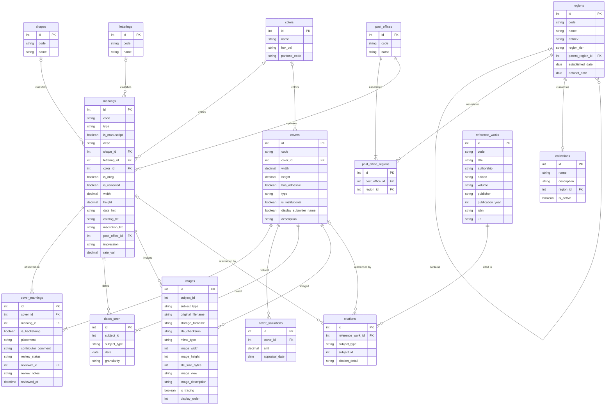

# WorldCovers | Model

## Summary

This document defines the structural vocabulary for data accessible through WorldCovers. Fifteen tables describe the philatelic domain's persistent state. `markings` is the central entity - the catalog entry itself - unifying town markings, rate markings, and auxiliary markings under a single type discriminator. Each row in `markings` carries the authoritative catalog text, the physical inscription of the device, and a reference to a row in `post_offices`, whose jurisdictional history is recorded in `post_office_regions` against a time-bounded `regions` hierarchy. `covers` are observations of markings, linked through the `cover_markings` junction, which also records per-observation positional context and review state. Marking classification is represented through two primary editorial dimensions: `shapes` and `letterings`. Both remain provisional editorial vocabularies: their current records preserve catalog usage patterns and known inconsistencies, and therefore do not yet constitute fully orthogonal or exhaustively normalized taxonomies. Curatorial responsibility is expressed through `collections`, each of which wraps exactly one region and serves as the routing target for contributions submitted within that region. Two junction tables resolve the document's many-to-many associations: `cover_markings` (covers to markings) and `post_office_regions` (post offices to regions). The latter exists because a post office is a fixed geographic place whose political jurisdiction can change over time; a marking's effective region context is derived by intersecting the post office's region associations with the marking's aggregated `dates_seen` (both those attached directly to the marking and those attached to its associated covers). System-internal tables (contributions, submission transactions, version snapshots, recycle-bin sidecars, FAQ entries, and role assignments) are intentionally not modeled in this document; they live alongside the domain tables in `backend/common/`.

## Domain Tables

### citations

Links a reference work to a cover or marking.

*Fields:*

* citation_detail - Specific location within the reference work (e.g., page number, section, url).  
* reference_work_id - Related reference work.  
* subject_id - Identifier of the cited resource.  
* subject_type - Type of the cited resource.

*Invariants:*

* reference_work_id references exactly one row in reference_works.  
* subject_type is one of COVER, or MARKING.  
* subject_id references exactly one resource of the type specified by subject_type.

*Relationships:*

* References exactly one reference work.  
* Targets exactly one cover or marking.

### collections

An institutional curatorial unit associated with exactly one region. Contributions submitted within a collection's region are routed to that collection for editorial review. A collection is the unit of curatorial scope: it carries the human-facing identity (display name, description, active state) under which a region's holdings are presented and reviewed, independent of who is currently assigned to work it.

*Fields:*

* description - Curatorial description of the collection.  
* is_active - Whether the collection is currently accepting submissions and editorial work.  
* name - Display name for the collection (e.g., "Virginia").  
* region_id - Related region; one collection per region.

*Invariants:*

* name is non-empty.  
* region_id references exactly one row in regions.  
* region_id is unique across all collections (one-to-one with regions). v2 realizes the vision-doc multi-catalog goal via this region axis only: historical eras are expressed through the time-bounded regions hierarchy, and specialty-axis catalogs are out of v2 scope.  
* is_active defaults to true.

*Relationships:*

* References exactly one region (one-to-one).

### colors

Value table of ink or cover material colors.

*Fields:*

* hex_val (nullable) - Hexadecimal color code for display rendering.  
* name - Display name of the color.  
* pantone_code (nullable) - Pantone reference code for precise color matching.

*Seed values:*

* BLACK  
* BLUE  
* RED  
* GREEN  
* BROWN  
* ORANGE  
* PURPLE  
* MAGENTA  
* VIOLET

*Invariants:*

* name is unique across all rows in colors.  
* hex_val defaults to "#FFFFFF".  
* The canonical color rows are supplied by the import pipeline, so a bare database has none. Imported bundles commonly include BLACK, but `markings.color_id` is nullable and has no model-level default.

*Relationships:*

* Referenced by zero or more rows in markings and covers.

### covers

A physical postal cover bearing one or more recorded markings. A cover is conceptually an observation of the markings it bears; each cover records a single-instance date and physical context for the markings it carries.

*Fields:*

* code - An editor-assigned reference identifier.  
* color_id - Ink or material color of the cover itself.  
* description - Freetext notes about the cover, shown on the public cover detail page.
* display_submitter_name - Whether the submitter opted in to show their name on the public cover detail page.
* type (nullable) - Physical form of the postal cover.  
* has_adhesive - Whether the cover bears an adhesive postage stamp alongside stampless markings.  
* height (nullable) - Vertical dimension of the cover.  
* is_institutional - Whether the cover is institutionally owned (museum, society, etc.).  
* width (nullable) - Horizontal dimension of the cover.

*Invariants:*

* color_id references zero or one row in colors; it is nullable with no default.  
* code, if blank on save, is auto-assigned as `C-<pk>` and made unique by suffixing when needed.
* display_submitter_name defaults to false.
* width and height are decimals in millimeters.  
* has_adhesive defaults to false.  
* is_institutional is nullable; a null value means the current data does not state institutional ownership.
* type, if set, stores one of: `FC` (Folded Cover), or `FL` (Folded Letter).

*Relationships:*

* Associated with one or more markings (via cover_markings).  
* Has zero or more dates_seen entries.  
* Has zero or more cover_valuations entries.  
* References zero or one color.  
* Referenced by zero or more citations.

### cover_markings

Junction linking a cover to a marking, with positional context describing how the marking appears on that particular cover.

*Fields:*

* cover_id - Related cover.  
* is_backstamp - Whether this marking appears on the reverse of the cover.  
* marking_id - Related marking.  
* placement (nullable) - Positional qualifier for the marking's location on the cover.
* contributor_comment (nullable) - Optional note from the contributor for reviewers.
* review_status - Review state for this cover-to-marking association.
* reviewer_id (nullable) - User who reviewed this association.
* review_notes - Editor feedback for this association.
* reviewed_at (nullable) - Review timestamp.

*Invariants:*

* cover_id references exactly one row in covers.  
* marking_id references exactly one row in markings.  
* The combination of cover_id and marking_id is unique.  
* is_backstamp defaults to false.  
* placement vocabulary is editorial and not yet enumerated; values should be drawn from an agreed controlled list once established.
* review_status is one of pending, approved, rejected, or needs_revision; it defaults to approved.
* reviewer_id and reviewed_at are nullable.

*Relationships:*

* References exactly one cover.  
* References exactly one marking.

### cover_valuations

An estimated collector market value for a cover, as published in a reference source.

*Fields:*

* amt (nullable) - Estimated collector market value.  
* appraisal_date (nullable) - Date of the valuation source.
* cover_id - Related cover.

*Invariants:*

* cover_id references exactly one row in covers.  
* amt, if set, represents a decimal USD amount; a null amt indicates an unpriced catalog entry.
* appraisal_date, if set, is the date (or nominal date) of the valuation source.
* The combination of cover_id and appraisal_date is unique.

*Relationships:*

* Belongs to exactly one cover.

### dates_seen

A single date point observed for either a cover or a marking. When attached to a cover, the date is anchored to a specific physical artifact. When attached directly to a marking, the date records a use of the marking that is not tied to a cover row -- for example, a catalog-attested date for a marking whose cover has not been recorded, or a documentary date drawn from a reference work.

*Fields:*

* date - Calendar date of the observed use.  
* granularity - Granularity of the recorded date.  
* subject_id - Identifier of the dated resource.  
* subject_type - Type of the dated resource.

*Invariants:*

* subject_type is one of COVER, or MARKING.  
* subject_id references exactly one resource of the type specified by subject_type.  
* granularity is one of DAY, MONTH, or YEAR.  
* If granularity is MONTH, the day component of date is synthetic (set to 01).  
* If granularity is YEAR, the month and day components of date are synthetic (set to 01).
* The combination of subject_type, subject_id, date, and granularity is unique.

*Relationships:*

* Targets exactly one cover or marking.

### images

Polymorphic image metadata for a file attached to either a cover or a marking.

*Fields:*

* display_order - Subject-local display position for gallery ordering.
* file_checksum - SHA-256 checksum of the stored file.
* file_size_bytes - Stored file size in bytes.
* image_description (nullable) - Editorial or contributor description.
* image_height - Pixel height.
* image_view - View type appropriate to the subject.
* image_width - Pixel width.
* is_tracing - Whether the image is a tracing or diagram rather than a photograph.
* mime_type - Stored file MIME type.
* original_filename - Original uploaded or source filename.
* storage_filename - Path below the media root.
* subject_id - Identifier of the imaged resource.
* subject_type - Type of the imaged resource.

*Invariants:*

* subject_type is one of COVER, or MARKING.
* subject_id references exactly one resource of the type specified by subject_type.
* image_view is one of FULL or DETAIL when subject_type is MARKING.
* image_view is one of FRONT, BACK, INTERIOR, or DETAIL when subject_type is COVER.
* storage_filename alone is not unique; the same file may be reused across different subjects.
* The combination of storage_filename, subject_type, and subject_id is unique.

*Relationships:*

* Targets exactly one cover or marking.

### letterings

Editorial value table for textual styling assigned to a postal marking. This vocabulary is intentionally provisional: current seed values preserve catalog usage and may mix type family, weight, stroke treatment, and stylistic descriptors.

*Fields:*

* code (nullable) - An editor-assigned reference identifier.  
* name - Display name of the typeface/style category.

*Seed values:*

* Italic  
* Serif  
* Sans-serif  
* Small  
* Large  
* Outline  
* Bold  
* Block  
* Gothic
* Thick
* Thin

*Invariants:*

* name is unique across all rows in letterings.  
* lettering values are editorial assignment categories and are not guaranteed to be mutually exclusive in a strict typographic sense.

*Relationships:*

* Referenced by zero or more rows in markings.

### markings

A postal marking -- town marking, rate marking, or auxiliary marking -- as observed on one or more covers. A marking may be a handstamped device or a manuscript inscription. All marking types share the same physical-device vocabulary (shape, lettering, impression, dimensions, color); the type discriminator captures functional role.

*Fields:*

* catalog_txt - Authoritative catalog entry text for this listing.  
* code - An editor-assigned reference identifier.  
* color_id (nullable) - Ink color of this marking.
* date_fmt (nullable) - Arrangement of date components inscribed on the device.  
* desc (nullable) - Freetext field for contributor to provide annotations.  
* height (nullable) - Vertical dimension of the marking impression.  
* impression (nullable) - Printing technique of the handstamp device.  
* inscription_txt - Text as physically inscribed on the marking.  
* is_irreg (nullable) - Whether the handstamp outline is non-uniform.  
* is_manuscript - Whether this is a handwritten marking rather than a handstamped device.  
* is_reviewed - Whether a state editor has personally vetted this record.
* lettering_id (nullable) - Typeface style observed on the handstamp.  
* post_office_id - Post office that produced this marking.  
* rate_val (nullable) - Numeric postal rate amount, where applicable.  
* shape_id (nullable) - Base geometric outline of the handstamp device.  
* type - Functional classification of this marking.  
* width (nullable) - Horizontal dimension of the marking impression.

*Invariants:*

* type is one of TOWNMARK, RATEMARK, or AUXMARK.  
* If is_manuscript is true, lettering_id must be null.  
* If is_manuscript is true, shape_id must be null.  
* If is_manuscript is false, shape_id may reference one row in shapes.
* lettering_id, if set, references exactly one row in letterings.  
* color_id references zero or one row in colors; it is nullable with no default.
* If is_manuscript is true, is_irreg must be null.  
* If is_manuscript is false, is_irreg is required.  
* is_reviewed defaults to false.
* width and height are decimals in millimeters.  
* date_fmt, if set, is one of: MD, MDD, YD, YMD, YMDD.  
* rate_val, if set, is a non-negative decimal representing the rate amount;  
* rate_val may be populated for any type but is most commonly associated with RATEMARK and with integrated-rate TOWNMARK devices.  
* catalog_txt is the authoritative ASCC catalog entry text for this listing.  
* inscription_txt is the text as it appears on the physical marking.  
* post_office_id references exactly one row in post_offices.  
* impression, if set, is one of: Normal, Stencil, Negative.  
* A marking may exist without any cover_markings rows; imported v1 bundles can omit cover rows, and users can add cover observations later.
* A marking's earliest and latest use dates are derived by aggregating two sources: dates_seen rows attached directly to the marking, and dates_seen rows attached to covers associated with the marking (via cover_markings). The marking row itself does not store its date range. A marking with no directly attached dates_seen and no associated covers therefore has no derivable date range.  
* A marking's region context is derived by joining its post office to post_office_regions and intersecting each linked region's date window with the marking's aggregated dates_seen (both direct and cover-mediated, as defined above). A marking may resolve to multiple regions when its observed dates span a region transition (e.g., a marking observed before and after a territory becomes a state). A marking with no derivable date range has no derivable region context.

*Relationships:*

* Associated with zero or more covers (via cover_markings).  
* Has zero or more dates_seen entries.  
* References zero or one shape.  
* References zero or one lettering.  
* References zero or one color.  
* Referenced by zero or more citations.  
* Belongs to exactly one post office.

### post_offices

A postal facility identified as a fixed geographic place. Its political jurisdiction over time is recorded as a set of associations to regions in post_office_regions; the post office row itself does not name a single region.

*Fields:*

* code - Editor-assigned reference identifier. Munger-generated values use `{catalog_region_code}-{serial}`, e.g. `USA-MA1-3`.
* name - Normalized town name used for filtering and grouping.

*Invariants:*

* code, if set, is unique across all rows in post_offices.
* name is the normalized town name (e.g., Abingdon, Richmond).  
* name is not constrained to be unique. Same-name post offices that fall within a single editor's scope (e.g., two "Princeton"s within Mercer County, NJ) are distinguished by editorial naming convention (e.g., "Princeton City", "Princeton Township") rather than by a database constraint.

*Relationships:*

* Associated with one or more regions (via post_office_regions).  
* Referenced by zero or more rows in markings.

### post_office_regions

Junction linking a post office to a region under whose jurisdiction it operated. The active window of each association is inherited from the region's established_date and defunct_date; the junction itself carries no temporal columns.

*Fields:*

* post_office_id - Related post office.  
* region_id - Related region.

*Invariants:*

* post_office_id references exactly one row in post_offices.  
* region_id references exactly one row in regions.  
* The combination of post_office_id and region_id is unique.  
* Temporal bounds of an association are derived from regions.established_date / regions.defunct_date; no per-association dates are stored.  
* A post office's regions are not constrained to be non-overlapping in time, since two regions linked to the same post office may have intentionally overlapping windows during administrative succession.

*Relationships:*

* References exactly one post office.  
* References exactly one region.

### reference_works

A citable publication or source.

*Fields:*

* code (nullable) - An editor-assigned reference identifier.  
* authorship - Author(s) or editor(s) of the publication.  
* isbn (nullable) - International Standard Book Number.  
* publication_year - Year of publication.  
* edition (nullable) - Released version of publication.  
* volume (nullable) - Identifier for a multi-volume series.  
* publisher - Publishing entity.  
* title - Name of the publication.  
* url (nullable) - Web address of the publication or digital resource.

*Invariants:*

* None beyond field presence.

*Relationships:*

* Referenced by zero or more citations.

### regions

A named geographic or administrative area used to organize post offices within a historical hierarchy.

*Fields:*

* established_date - First date on which this region definition is considered in force.  
* defunct_date (nullable) - Last date on which this region definition is considered in force.  
* code - Editor-assigned reference identifier.
* name - Canonical region name for the applicable historical period.  
* abbrev - Canonical two or three character abbreviation.  
* parent_region_id (nullable) - Immediate containing region in the hierarchy.  
* region_tier - Administrative level of this region.

*Invariants:*

* region_tier is one of COUNTRY, TERRITORY, STATE, PROVINCE, COUNTY, CITY, DISTRICT, or OTHER.  
* parent_region_id, if set, references exactly one row in regions.  
* A region cannot parent itself.  
* If both established_date and defunct_date are set, established_date must be less than or equal to defunct_date.  
* code, if set, is unique across all rows in regions.
* A region with a non-null defunct_date is considered inactive. A null defunct_date indicates the region is still considered active within the modeled historical hierarchy.  
* Region identity is historical rather than purely modern; records with the same name may exist for different periods or different parents.

*Relationships:*

* May belong to zero or one parent region.  
* May contain zero or more child regions.  
* Associated with zero or more post offices (via post_office_regions).  
* Referenced by zero or one collection (one-to-one).

### shapes

Editorial value table for the primary form assigned to a postal marking. This vocabulary is intentionally provisional: while many values describe base geometry, some records reflect catalog terminology that may combine geometry, motif, framing treatment, or construction style. Compound ASCC codes (e.g., DC, DLC, DLDC, DO, DLO, DLDO, NOR) are carried verbatim as rows in shapes rather than decomposed into separate shape-and-framing axes.

*Fields:*

* code (nullable) - An editor-assigned reference identifier.  
* name - Display name of the assigned form category.

*Invariants:*

* name is unique across all rows in shapes.  
* shape values are editorial assignment categories and are not guaranteed to be mutually exclusive in a strict taxonomic sense.

*Relationships:*

* Referenced by zero or more rows in markings.

## ER Diagram

